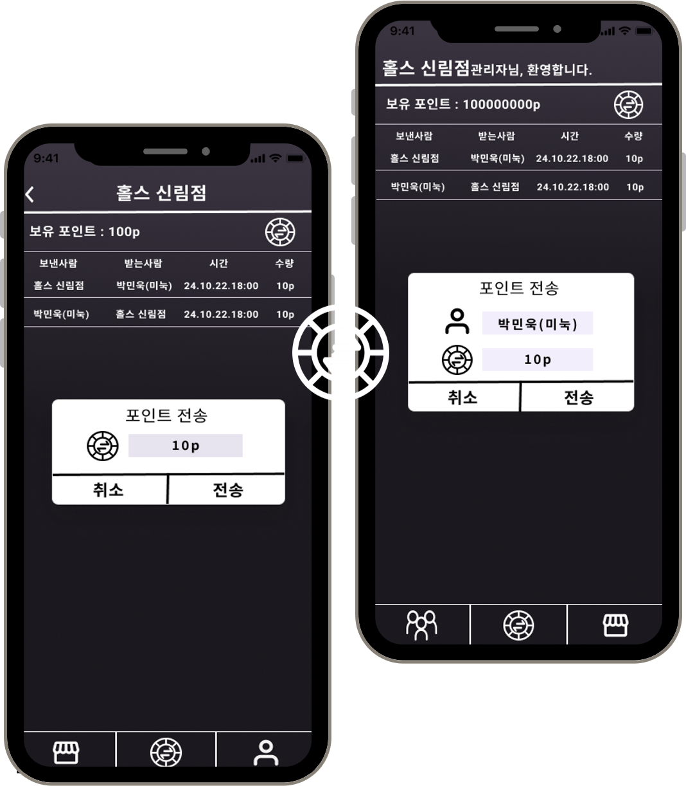
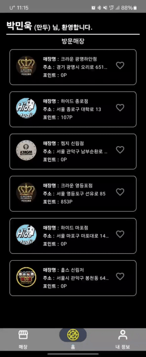
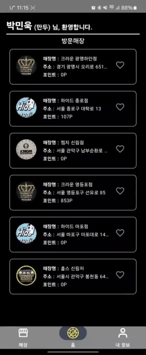
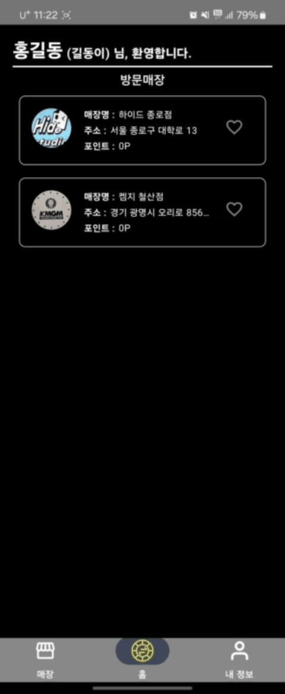

# 🃏 Pokerever

  

**Pokerever**는 변화하는 Poker 산업의 정부 지침에 따라 사용자 간 포인트 송수신을 지양하고,  
사용자와 매장 간에만 포인트 송수신이 가능하도록 접근을 제어하며 사용자에게 편의성을 제공하기 위해 제작된 앱입니다.  

Firestore 기반 포인트 관리 및 트랜잭션 내역 표시 기능을 포함한 포인트 추적 앱입니다.  
Jetpack Compose 기반의 최신 Android 기술을 활용하여 실시간 UI 업데이트, 트랜잭션 로그 표시,  
사용자 인터랙션을 효율적으로 구현했습니다.

---
<h2>📽️ 데모 영상 (GIF)</h2>

<table>
  <tr>
    <td align="center"><strong>🔐 회원가입</strong></td>
    <td align="center"><strong>🏪 매장정보 확인</strong></td>
  </tr>
  <tr>
    <td></td>
    <td></td>
  </tr>

  <tr>
    <td align="center"><strong>📊 탭별 정보 인터페이스</strong></td>
    <td align="center"><strong>💸 포인트 송수신 기능</strong></td>
  </tr>
  <tr>
    <td></td>
    <td></td>
  </tr>
</table>

### 📍 매장위치 확인  

---

## 📱 주요 기능

- 🔄 **실시간 포인트 반영**: Firestore의 `observeUserPoints` 기능을 통해 포인트 변화가 즉시 UI에 반영됩니다.
- 🧾 **트랜잭션 리스트**: `LazyTransactionListFile.kt`를 통한 트랜잭션 내역 관리, 실명 처리 기능 포함.
- ⚙️ **Compose 최적화**: `LaunchedEffect` 대신 ViewModel에서 비동기 데이터를 처리하여 퍼포먼스를 향상.
- 🧠 **사용자 이름 처리 최적화**: `.fromName`, `.toName` 값 미리 세팅하여 렌더링 시 지연 없이 표시.

---

## 🧱 기술 스택

- **Architecture**: MVVM + Clean Architecture  
- **UI**: Jetpack Compose  
- **Dependency Injection**: Dagger-Hilt  
- **Image Loading**: Coil  
- **Realtime Database**: Cloud Firestore  

---

## 🛠️ 개선 사항 요약

| 이슈 | 해결 방식 | 결과 |
|------|-----------|------|
| Firestore 실시간 반영 불가 | `observeUserPoints`의 값 변화를 `mutableStateOf`로 처리 | 실시간 포인트 UI 반영 |
| 트랜잭션 이름 비동기 지연 | ViewModel에서 이름을 미리 fetch | 더 빠른 렌더링 |
| 리스트 렌더링 지연 | `items(..., key = { ... })` 명시적 키 지정 | 성능 개선 및 Warning 제거 |

